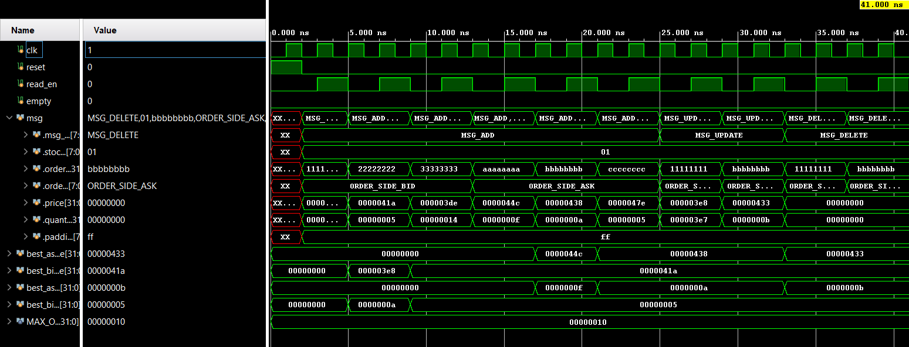

# 🚀 FPGA-Based Limit Order Book

A high-performance, hardware-simulated order book modeled after modern exchange architecture — implemented in SystemVerilog.

## 📈 Features

- Supports ITCH-style `ADD`, `UPDATE`, `DELETE` messages
- Sorted bid/ask arrays (descending/ascending)
- Automatic compaction on delete
- Tracks best bid/ask price and quantity
- Fully testbenched with waveform inspection

## 📂 Project Structure
fpga-order-book/ 
├── rtl/ 
│   └── order_book.sv 
│   └── parser_defs.sv 
├── sim/ 
│   └── order_book_tb.sv 
├── waveforms/ 
│   └── order_book_best_bid_ask.png 
├── README.md 
└── .gitignore 

## 📊 Sample Waveform

## 💬 tcl-console output

------ BID SIDE ------  
BID[0] ID:11111111 P:1000 Q:10  
------ ASK SIDE ------  
Best Bid: $0 (0 shares)  
Best Ask: $0 (0 shares)  
----------------------  
  
------ BID SIDE ------  
BID[0] ID:22222222 P:1050 Q:5  
BID[1] ID:11111111 P:1000 Q:10  
------ ASK SIDE ------  
Best Bid: $1000 (10 shares)  
Best Ask: $0 (0 shares)  
----------------------  
  
------ BID SIDE ------  
BID[0] ID:22222222 P:1050 Q:5  
BID[1] ID:11111111 P:1000 Q:10  
BID[2] ID:33333333 P:990 Q:20  
------ ASK SIDE ------  
Best Bid: $1050 (5 shares)  
Best Ask: $0 (0 shares)  
----------------------  
  
------ BID SIDE ------  
BID[0] ID:22222222 P:1050 Q:5  
BID[1] ID:11111111 P:1000 Q:10  
BID[2] ID:33333333 P:990 Q:20  
------ ASK SIDE ------  
ASK[0] ID:aaaaaaaa P:1100 Q:15  
Best Bid: $1050 (5 shares)  
Best Ask: $0 (0 shares)  
----------------------  
  
------ BID SIDE ------  
BID[0] ID:22222222 P:1050 Q:5  
BID[1] ID:11111111 P:1000 Q:10  
BID[2] ID:33333333 P:990 Q:20  
------ ASK SIDE ------  
ASK[0] ID:bbbbbbbb P:1080 Q:10  
ASK[1] ID:aaaaaaaa P:1100 Q:15  
Best Bid: $1050 (5 shares)  
Best Ask: $1100 (15 shares)  
----------------------  
  
------ BID SIDE ------  
BID[0] ID:22222222 P:1050 Q:5  
BID[1] ID:11111111 P:1000 Q:10  
BID[2] ID:33333333 P:990 Q:20  
------ ASK SIDE ------  
ASK[0] ID:bbbbbbbb P:1080 Q:10  
ASK[1] ID:aaaaaaaa P:1100 Q:15  
ASK[2] ID:cccccccc P:1150 Q:5  
Best Bid: $1050 (5 shares)  
Best Ask: $1080 (10 shares)  
----------------------  
  
------ BID SIDE ------  
BID[0] ID:22222222 P:1050 Q:5  
BID[1] ID:11111111 P:1000 Q:999  
BID[2] ID:33333333 P:990 Q:20  
------ ASK SIDE ------  
ASK[0] ID:bbbbbbbb P:1080 Q:10  
ASK[1] ID:aaaaaaaa P:1100 Q:15  
ASK[2] ID:cccccccc P:1150 Q:5  
Best Bid: $1050 (5 shares)  
Best Ask: $1080 (10 shares)  
----------------------  
  
------ BID SIDE ------  
BID[0] ID:22222222 P:1050 Q:5  
BID[1] ID:11111111 P:1000 Q:999  
BID[2] ID:33333333 P:990 Q:20  
------ ASK SIDE ------  
ASK[0] ID:bbbbbbbb P:1075 Q:11  
ASK[1] ID:aaaaaaaa P:1100 Q:15  
ASK[2] ID:cccccccc P:1150 Q:5  
Best Bid: $1050 (5 shares)  
Best Ask: $1080 (10 shares)  
----------------------  
  
------ BID SIDE ------  
BID[0] ID:22222222 P:1050 Q:5  
BID[1] ID:33333333 P:990 Q:20  
------ ASK SIDE ------  
ASK[0] ID:bbbbbbbb P:1075 Q:11  
ASK[1] ID:aaaaaaaa P:1100 Q:15  
ASK[2] ID:cccccccc P:1150 Q:5  
Best Bid: $1050 (5 shares)  
Best Ask: $1075 (11 shares)  
----------------------  
  
------ BID SIDE ------  
BID[0] ID:22222222 P:1050 Q:5  
BID[1] ID:33333333 P:990 Q:20  
------ ASK SIDE ------  
ASK[0] ID:aaaaaaaa P:1100 Q:15  
ASK[1] ID:cccccccc P:1150 Q:5  
Best Bid: $1050 (5 shares)  
Best Ask: $1075 (11 shares)  
----------------------  
  
Testbench complete.  
